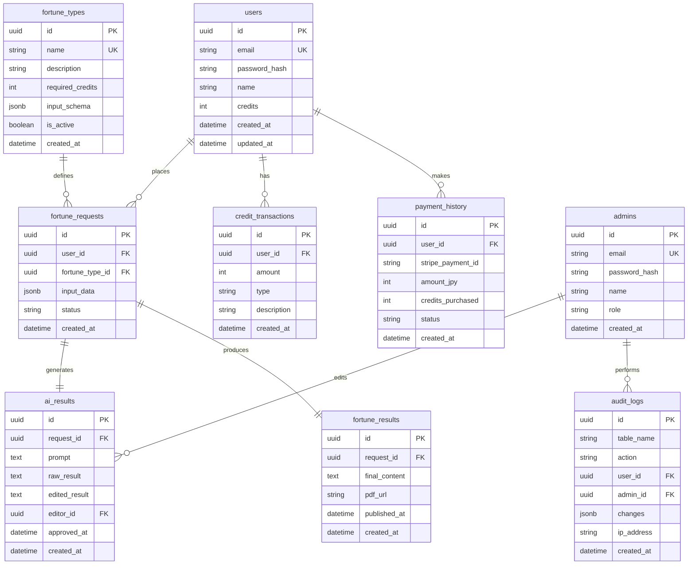
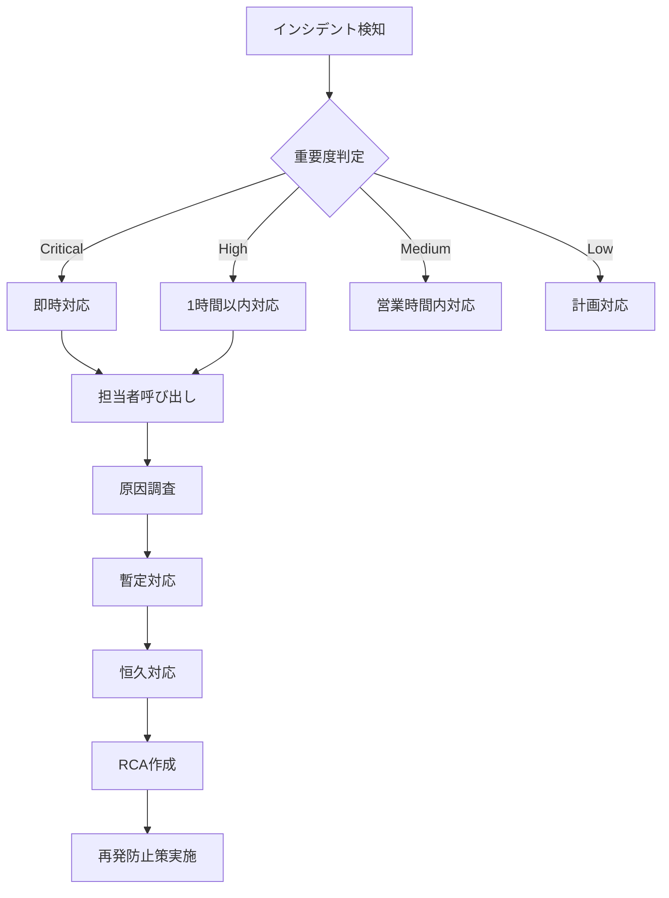

# 占い自動鑑定システム 基本設計書

## 改訂履歴

| 版数 | 改訂日 | 改訂内容 |
|------|--------|----------|
| 1.0 | 2025/06/03 | 初版作成 |
| 1.1 | 2025/06/03 | レビュー指摘事項反映（工数見直し、テーブル追加、運用設計強化） |

## 1. システム概要

### 1.1 システム構成図

```
┌─────────────────────────────────────────────────────────────────┐
│                          クライアント層                             │
├─────────────────────┬───────────────────┬───────────────────────┤
│   Webブラウザ         │   モバイルブラウザ    │    管理者ブラウザ      │
│  (Chrome/Safari)    │  (iOS/Android)      │   (管理画面専用)      │
└──────────┬──────────┴─────────┬─────────┴──────────┬────────────┘
           │                    │                    │
           └────────────────────┴────────────────────┘
                                │
                         [HTTPS/WSS]
                                │
┌─────────────────────────────────────────────────────────────────┐
│                           Vercel Edge                             │
│  ┌─────────────────────────────────────────────────────────┐   │
│  │                    Next.js 14 App Router                   │   │
│  │  ┌──────────┐  ┌──────────┐  ┌──────────┐  ┌──────────┐│   │
│  │  │   SSR    │  │   API    │  │ Static   │  │Middleware││   │
│  │  │  Pages   │  │  Routes  │  │  Assets  │  │  (Auth)  ││   │
│  │  └──────────┘  └──────────┘  └──────────┘  └──────────┘│   │
│  └─────────────────────────────────────────────────────────┘   │
└─────────────────────────────────────────────────────────────────┘
                                │
                    ┌───────────┴───────────┐
                    │                       │
┌───────────────────▼──┐           ┌───────▼────────────────┐
│   Supabase (DB)      │           │   External APIs        │
│  ┌─────────────────┐ │           │ ┌──────────────────┐  │
│  │  PostgreSQL     │ │           │ │ Anthropic Claude │  │
│  │  ┌───────────┐  │ │           │ └──────────────────┘  │
│  │  │  Tables   │  │ │           │ ┌──────────────────┐  │
│  │  │  - users  │  │ │           │ │     Stripe       │  │
│  │  │  - admins │  │ │           │ └──────────────────┘  │
│  │  │  - etc    │  │ │           │ ┌──────────────────┐  │
│  │  └───────────┘  │ │           │ │     Resend       │  │
│  └─────────────────┘ │           │ └──────────────────┘  │
│  ┌─────────────────┐ │           │ ┌──────────────────┐  │
│  │   File Storage  │ │           │ │  Uploadthing     │  │
│  └─────────────────┘ │           │ └──────────────────┘  │
└──────────────────────┘           └────────────────────────┘
```

### 1.2 技術スタック詳細

| レイヤー | 技術 | バージョン/詳細 |
|---------|------|---------------|
| フロントエンド | Next.js | 14.x (App Router) |
| | TypeScript | 5.x |
| | Tailwind CSS | 3.x |
| | shadcn/ui | 最新版 |
| | React Hook Form | 7.x |
| バックエンド | Next.js API Routes | 14.x |
| | Prisma | 5.x |
| | NextAuth.js | 5.x (Auth.js) |
| | tRPC | 10.x |
| データベース | PostgreSQL | 15.x (Supabase) |
| AI | Anthropic Claude | claude-3-sonnet-20240229 |
| 決済 | Stripe | 最新版 |
| メール | Resend | 最新版 |
| ファイル | Uploadthing | 最新版 |
| PDF生成 | React PDF | 3.x |
| ホスティング | Vercel | Pro Plan |
| キューイング | Bull | 4.x |

## 2. アーキテクチャ設計

### 2.1 レイヤードアーキテクチャ

```
┌─────────────────────────────────────────┐
│        Presentation Layer               │
│   (React Components, Pages)             │
├─────────────────────────────────────────┤
│        Application Layer                │
│   (tRPC Routers, Business Logic)       │
├─────────────────────────────────────────┤
│        Domain Layer                     │
│   (Entity Models, Domain Services)      │
├─────────────────────────────────────────┤
│        Infrastructure Layer             │
│   (Prisma, External APIs, Storage)     │
└─────────────────────────────────────────┘
```

### 2.2 ディレクトリ構造

```
fortune-telling-system/
├── app/                      # Next.js App Router
│   ├── (auth)/              # 認証関連ページ
│   │   ├── login/
│   │   ├── register/
│   │   └── reset-password/
│   ├── (main)/              # メインアプリケーション
│   │   ├── dashboard/
│   │   ├── fortune/
│   │   ├── history/
│   │   └── payment/
│   ├── (admin)/             # 管理者ページ
│   │   ├── admin/
│   │   ├── users/
│   │   ├── fortunes/
│   │   └── reports/
│   ├── api/                 # API Routes
│   │   ├── trpc/
│   │   ├── webhook/
│   │   └── auth/
│   └── layout.tsx
├── components/              # 共通コンポーネント
│   ├── ui/                 # shadcn/ui components
│   ├── forms/
│   ├── layouts/
│   └── features/
├── lib/                    # ライブラリ・ユーティリティ
│   ├── auth/
│   ├── db/
│   ├── ai/
│   ├── payment/
│   └── utils/
├── server/                 # サーバーサイドロジック
│   ├── routers/           # tRPC routers
│   ├── services/          # ビジネスロジック
│   └── db/               # Prismaクライアント
├── types/                 # TypeScript型定義
├── hooks/                 # カスタムフック
├── prisma/                # Prismaスキーマ・マイグレーション
└── public/               # 静的ファイル
```

## 3. データベース設計

### 3.1 ER図



### 3.2 テーブル定義詳細

#### users（ユーザー）
| カラム名 | 型 | 制約 | 説明 |
|---------|---|------|------|
| id | UUID | PK | ユーザーID |
| email | VARCHAR(255) | UK, NOT NULL | メールアドレス |
| password_hash | VARCHAR(255) | NOT NULL | パスワードハッシュ |
| name | VARCHAR(100) | NOT NULL | ユーザー名 |
| credits | INTEGER | NOT NULL DEFAULT 0 | 保有クレジット数 |
| email_verified | BOOLEAN | DEFAULT FALSE | メール認証済みフラグ |
| created_at | TIMESTAMP | NOT NULL | 作成日時 |
| updated_at | TIMESTAMP | NOT NULL | 更新日時 |

#### admins（管理者）
| カラム名 | 型 | 制約 | 説明 |
|---------|---|------|------|
| id | UUID | PK | 管理者ID |
| email | VARCHAR(255) | UK, NOT NULL | メールアドレス |
| password_hash | VARCHAR(255) | NOT NULL | パスワードハッシュ |
| name | VARCHAR(100) | NOT NULL | 管理者名 |
| role | VARCHAR(20) | NOT NULL | 権限（super_admin/admin） |
| created_at | TIMESTAMP | NOT NULL | 作成日時 |

#### fortune_types（占い種別マスタ）
| カラム名 | 型 | 制約 | 説明 |
|---------|---|------|------|
| id | UUID | PK | 占い種別ID |
| name | VARCHAR(50) | UK, NOT NULL | 占い種別名 |
| description | TEXT | | 説明文 |
| required_credits | INTEGER | NOT NULL | 必要クレジット数 |
| input_schema | JSONB | NOT NULL | 入力スキーマ定義 |
| is_active | BOOLEAN | DEFAULT TRUE | 有効フラグ |
| created_at | TIMESTAMP | NOT NULL | 作成日時 |

#### fortune_requests（占い申込）
| カラム名 | 型 | 制約 | 説明 |
|---------|---|------|------|
| id | UUID | PK | 申込ID |
| user_id | UUID | FK, NOT NULL | ユーザーID |
| fortune_type_id | UUID | FK, NOT NULL | 占い種別ID |
| input_data | JSONB | NOT NULL | 入力データ |
| status | VARCHAR(20) | NOT NULL | ステータス |
| created_at | TIMESTAMP | NOT NULL | 申込日時 |

#### audit_logs（監査ログ）
| カラム名 | 型 | 制約 | 説明 |
|---------|---|------|------|
| id | UUID | PK | ログID |
| table_name | VARCHAR(50) | NOT NULL | テーブル名 |
| action | VARCHAR(20) | NOT NULL | 操作種別 |
| user_id | UUID | FK | ユーザーID |
| admin_id | UUID | FK | 管理者ID |
| changes | JSONB | | 変更内容 |
| ip_address | VARCHAR(45) | | IPアドレス |
| created_at | TIMESTAMP | NOT NULL | 操作日時 |

入力データ例（JSONB）:
```json
{
  "name": "山田太郎",
  "birthdate": "1990-01-01",
  "birthtime": "10:30",
  "birthplace": "東京都",
  "gender": "male",
  "consultation": "仕事運について"
}
```

占い種別入力スキーマ例（fortune_types.input_schema）:
```json
{
  "required": ["name", "birthdate", "gender", "consultation"],
  "optional": ["birthtime", "birthplace"],
  "fields": {
    "birthtime": {
      "type": "time",
      "label": "出生時刻"
    },
    "birthplace": {
      "type": "location",
      "label": "出生地"
    }
  }
}
```

## 4. API設計

### 4.1 tRPC Router構成

```typescript
// server/routers/index.ts
export const appRouter = createTRPCRouter({
  auth: authRouter,
  user: userRouter,
  fortune: fortuneRouter,
  credit: creditRouter,
  payment: paymentRouter,
  admin: adminRouter,
});
```

### 4.2 主要エンドポイント

#### 認証関連
| エンドポイント | メソッド | 説明 |
|---------------|---------|------|
| auth.register | mutation | ユーザー登録 |
| auth.login | mutation | ログイン |
| auth.logout | mutation | ログアウト |
| auth.resetPassword | mutation | パスワードリセット |

#### 占い関連
| エンドポイント | メソッド | 説明 |
|---------------|---------|------|
| fortune.getTypes | query | 占い種別一覧取得 |
| fortune.create | mutation | 占い申込 |
| fortune.getHistory | query | 鑑定履歴取得 |
| fortune.getResult | query | 鑑定結果取得 |
| fortune.downloadPDF | query | PDF ダウンロード |

#### 決済関連
| エンドポイント | メソッド | 説明 |
|---------------|---------|------|
| payment.createCheckout | mutation | Stripe Checkout作成 |
| payment.getHistory | query | 購入履歴取得 |
| credit.getBalance | query | クレジット残高取得 |
| credit.getTransactions | query | 取引履歴取得 |

## 5. 画面設計

### 5.1 画面一覧

| 画面名 | パス | 説明 | 認証 |
|-------|------|------|------|
| ログイン | /login | ユーザーログイン | 不要 |
| 新規登録 | /register | ユーザー登録 | 不要 |
| ダッシュボード | /dashboard | メイン画面 | 必要 |
| 占い選択 | /fortune | 占い種別選択 | 必要 |
| 占い申込 | /fortune/[type] | 情報入力 | 必要 |
| 鑑定履歴 | /history | 過去の鑑定一覧 | 必要 |
| 鑑定結果 | /result/[id] | 鑑定結果表示 | 必要 |
| クレジット購入 | /payment | 決済画面 | 必要 |
| 管理者ログイン | /admin/login | 管理者ログイン | 不要 |
| 管理ダッシュボード | /admin | 管理者メイン | 管理者 |
| 鑑定管理 | /admin/fortunes | AI結果編集 | 管理者 |
| ユーザー管理 | /admin/users | ユーザー一覧 | 管理者 |

### 5.2 画面遷移図

```
[ログイン] ─────┐
                ├──→ [ダッシュボード] ──→ [占い選択] ──→ [占い申込] ──→ [完了]
[新規登録] ─────┘         │                                             │
                         ├──→ [鑑定履歴] ──→ [鑑定結果]                 │
                         │                      ↓                      │
                         └──→ [クレジット購入]   [PDF出力]               │
                                                                      │
                                    [メール通知] ←─────────────────────┘
```

### 5.3 レスポンシブ設計

| デバイス | ブレークポイント | 対応内容 |
|---------|---------------|---------|
| Mobile | < 640px | 1カラムレイアウト、ハンバーガーメニュー |
| Tablet | 640px - 1024px | 2カラムレイアウト、サイドバー表示 |
| Desktop | > 1024px | 3カラムレイアウト、全機能表示 |

## 6. セキュリティ設計

### 6.1 認証・認可

```typescript
// 認証フロー
1. メールアドレス + パスワードでログイン
2. NextAuth.jsがJWTトークン発行
3. セッションCookieに保存（httpOnly, secure）
4. APIアクセス時にトークン検証

// 認可レベル
- Guest: 未認証ユーザー
- User: 一般ユーザー
- Admin: 一般管理者
- SuperAdmin: スーパー管理者
```

### 6.2 セキュリティ対策

| 脅威 | 対策 |
|-----|------|
| SQLインジェクション | Prisma ORM使用、パラメータバインディング |
| XSS | React自動エスケープ、CSP設定 |
| CSRF | NextAuth.js CSRF保護、SameSite Cookie |
| 総当たり攻撃 | レート制限、アカウントロック |
| セッションハイジャック | HTTPS強制、Secure Cookie |
| 不正なファイルアップロード | ファイルタイプ検証、サイズ制限 |

### 6.3 データ保護

```typescript
// 個人情報の暗号化
- パスワード: bcrypt (salt rounds: 12)
- 生年月日: AES-256暗号化
- 決済情報: Stripeに委託（PCI DSS準拠）

// アクセス制御
- Row Level Security (RLS) 有効化
- ユーザーは自分のデータのみアクセス可能
- 管理者は権限に応じたアクセス制御
```

## 7. 外部API連携設計

### 7.1 Claude API連携

```typescript
// リクエスト例
const generateFortune = async (data: FortuneInput) => {
  const prompt = buildPrompt(data);
  
  const response = await anthropic.messages.create({
    model: 'claude-3-sonnet-20240229',
    max_tokens: 1500,
    temperature: 0.7,
    messages: [{
      role: 'user',
      content: prompt
    }]
  });
  
  return response.content[0].text;
};

// レート制限対策（詳細設計）
import Bull from 'bull';
import Redis from 'ioredis';

const fortuneQueue = new Bull('fortune-generation', {
  redis: {
    host: process.env.REDIS_HOST,
    port: process.env.REDIS_PORT,
  },
  defaultJobOptions: {
    removeOnComplete: true,
    removeOnFail: false,
    attempts: 3,
    backoff: {
      type: 'exponential',
      delay: 2000,
    }
  }
});

// ジョブ処理
fortuneQueue.process(2, async (job) => { // 同時実行数: 2
  const { requestId, data } = job.data;
  
  // レート制限チェック（1分10リクエスト）
  const rateLimiter = new RateLimiter({
    points: 10,
    duration: 60,
  });
  
  await rateLimiter.consume('claude-api');
  
  try {
    const result = await generateFortune(data);
    await saveAIResult(requestId, result);
    
    // 管理者に通知
    await notifyAdmins(requestId);
    
    return result;
  } catch (error) {
    if (error.status === 429) { // レート制限エラー
      throw new Error('Rate limit exceeded');
    }
    throw error;
  }
});

// 優先度付きキュー
export const addFortuneJob = async (requestId: string, data: FortuneInput, priority: number = 0) => {
  return await fortuneQueue.add(
    { requestId, data },
    { priority }
  );
};
```

### 7.2 Stripe連携

```typescript
// Checkout Session作成
const createCheckoutSession = async (credits: number) => {
  const session = await stripe.checkout.sessions.create({
    payment_method_types: ['card'],
    line_items: [{
      price_data: {
        currency: 'jpy',
        product_data: {
          name: `${credits}クレジット`,
          description: '占い鑑定用クレジット'
        },
        unit_amount: 500 * credits,
      },
      quantity: 1,
    }],
    mode: 'payment',
    success_url: `${baseUrl}/payment/success`,
    cancel_url: `${baseUrl}/payment/cancel`,
  });
  
  return session;
};

// Webhook処理
- payment_intent.succeeded: クレジット付与
- payment_intent.failed: エラー処理
```

## 8. エラー設計

### 8.1 エラーコード体系

| コード | カテゴリ | 説明 |
|-------|---------|------|
| AUTH001-099 | 認証エラー | ログイン失敗、セッション切れ等 |
| USER100-199 | ユーザーエラー | 入力エラー、権限不足等 |
| FORTUNE200-299 | 占いエラー | クレジット不足、申込エラー等 |
| PAYMENT300-399 | 決済エラー | 決済失敗、Stripeエラー等 |
| AI400-499 | AIエラー | Claude APIエラー、生成失敗等 |
| SYSTEM500-599 | システムエラー | サーバーエラー、DB接続エラー等 |

### 8.2 エラーハンドリング

```typescript
// グローバルエラーハンドラー
export class AppError extends Error {
  constructor(
    public code: string,
    public message: string,
    public statusCode: number = 400,
    public details?: any
  ) {
    super(message);
  }
}

// エラーレスポンス形式
{
  "error": {
    "code": "FORTUNE201",
    "message": "クレジットが不足しています",
    "details": {
      "required": 1,
      "current": 0
    }
  }
}
```

#### 8.3 エラーメッセージ日本語化

```typescript
// エラーメッセージ定義
export const ERROR_MESSAGES = {
  // 認証エラー (AUTH001-099)
  AUTH001: 'メールアドレスまたはパスワードが正しくありません',
  AUTH002: 'セッションの有効期限が切れました。再度ログインしてください',
  AUTH003: 'このメールアドレスは既に登録されています',
  AUTH004: 'メールアドレスの形式が正しくありません',
  AUTH005: 'パスワードは8文字以上で、英数字を含む必要があります',
  
  // ユーザーエラー (USER100-199)
  USER101: '必須項目が入力されていません',
  USER102: '生年月日の形式が正しくありません',
  USER103: '相談内容は500文字以内で入力してください',
  USER104: 'この操作を行う権限がありません',
  
  // 占いエラー (FORTUNE200-299)
  FORTUNE201: 'クレジットが不足しています',
  FORTUNE202: '選択された占い種別は現在利用できません',
  FORTUNE203: '占い申込の処理に失敗しました。時間をおいて再度お試しください',
  FORTUNE204: '鑑定結果が見つかりません',
  
  // 決済エラー (PAYMENT300-399)
  PAYMENT301: '決済処理に失敗しました',
  PAYMENT302: 'クレジットカード情報が正しくありません',
  PAYMENT303: '決済がキャンセルされました',
  PAYMENT304: '領収書の発行に失敗しました',
  
  // AIエラー (AI400-499)
  AI401: 'AI鑑定の生成に失敗しました。混雑しているため、しばらくお待ちください',
  AI402: 'AI APIの利用制限に達しました。時間をおいて再度お試しください',
  AI403: '鑑定文の生成がタイムアウトしました',
  
  // システムエラー (SYSTEM500-599)
  SYSTEM500: 'システムエラーが発生しました。管理者に連絡してください',
  SYSTEM501: 'データベース接続エラーが発生しました',
  SYSTEM502: 'ファイルのアップロードに失敗しました',
  SYSTEM503: 'PDFの生成に失敗しました',
};

// エラー表示コンポーネント
export const ErrorMessage: React.FC<{ code: string }> = ({ code }) => {
  const message = ERROR_MESSAGES[code] || 'エラーが発生しました';
  
  return (
    <div className="bg-red-50 border border-red-200 rounded-md p-4">
      <p className="text-red-800">{message}</p>
    </div>
  );
};
```

## 9. パフォーマンス設計

### 9.1 最適化方針

| 項目 | 目標値 | 対策 |
|-----|--------|------|
| 初回表示 | 3秒以内 | SSG/ISR活用、画像最適化 |
| API応答 | 1秒以内 | インデックス最適化、キャッシュ |
| PDF生成 | 5秒以内 | 非同期処理、Worker利用 |
| 同時接続 | 1000人 | Edge Functions、CDN活用 |

### 9.2 キャッシュ戦略

```typescript
// キャッシュレベル
1. ブラウザキャッシュ: 静的アセット（1年）
2. CDNキャッシュ: 画像、CSS、JS（1ヶ月）
3. APIキャッシュ: 
   - 占い種別一覧: 1日
   - ユーザー情報: 5分
   - 鑑定結果: 永続
4. DBクエリキャッシュ: Prisma Query Cache
```

## 10. メール通知設計

### 10.1 メールテンプレート一覧

| テンプレート名 | 送信タイミング | 優先度 |
|---------------|--------------|--------|
| 会員登録完了 | 登録直後 | 高 |
| メールアドレス確認 | 登録時 | 高 |
| パスワードリセット | リセット要求時 | 高 |
| 占い申込完了 | 申込直後 | 中 |
| 鑑定結果完成通知 | 承認完了時 | 高 |
| クレジット購入完了 | 決済成功時 | 高 |
| クレジット残高不足 | 申込試行時 | 中 |

### 10.2 メールテンプレート例

```typescript
// 鑑定結果完成通知
export const fortuneCompleteTemplate = {
  subject: '【占い自動鑑定】鑑定結果が完成しました',
  html: `
<!DOCTYPE html>
<html>
<head>
  <meta charset="UTF-8">
  <style>
    body { font-family: sans-serif; line-height: 1.6; color: #333; }
    .container { max-width: 600px; margin: 0 auto; padding: 20px; }
    .header { background-color: #667eea; color: white; padding: 20px; text-align: center; }
    .content { padding: 20px; background-color: #f7fafc; }
    .button { display: inline-block; padding: 12px 24px; background-color: #667eea; color: white; text-decoration: none; border-radius: 4px; }
    .footer { text-align: center; padding: 20px; color: #718096; font-size: 12px; }
  </style>
</head>
<body>
  <div class="container">
    <div class="header">
      <h1>鑑定結果のお知らせ</h1>
    </div>
    <div class="content">
      <p>{{userName}} 様</p>
      <p>お待たせいたしました。<br>
      ご依頼いただいた「{{fortuneType}}」の鑑定結果が完成しました。</p>
      
      <p>以下のボタンから鑑定結果をご確認いただけます。</p>
      
      <p style="text-align: center; margin: 30px 0;">
        <a href="{{resultUrl}}" class="button">鑑定結果を見る</a>
      </p>
      
      <p>※このメールに心当たりがない場合は、お手数ですが削除してください。</p>
    </div>
    <div class="footer">
      <p>占い自動鑑定システム<br>
      © 2025 Fortune Telling System. All rights reserved.</p>
    </div>
  </div>
</body>
</html>
  `,
  text: `
{{userName}} 様

お待たせいたしました。
ご依頼いただいた「{{fortuneType}}」の鑑定結果が完成しました。

以下のURLから鑑定結果をご確認いただけます。
{{resultUrl}}

※このメールに心当たりがない場合は、お手数ですが削除してください。

占い自動鑑定システム
  `
};

// メール送信サービス
export const sendEmail = async (
  to: string,
  template: EmailTemplate,
  variables: Record<string, string>
) => {
  const { subject, html, text } = template;
  
  // 変数置換
  const processedHtml = replaceVariables(html, variables);
  const processedText = replaceVariables(text, variables);
  
  await resend.emails.send({
    from: 'noreply@fortune-telling.com',
    to,
    subject,
    html: processedHtml,
    text: processedText,
  });
};
```

## 11. 運用設計

### 11.1 監視項目

| 項目 | ツール | アラート閾値 |
|-----|--------|------------|
| アップタイム | Vercel Analytics | 99.5%以下 |
| レスポンスタイム | Vercel Analytics | 3秒以上 |
| エラー率 | Sentry | 1%以上 |
| API使用量 | Claude Dashboard | 80%以上 |
| DB接続数 | Supabase | 80%以上 |
| クレジット購入率 | カスタムメトリクス | 前日比-20% |

### 11.2 バックアップ・リカバリー

```yaml
バックアップ計画:
  データベース:
    頻度: 日次（深夜2時）
    保存期間: 30日
    方式: Supabase自動バックアップ
    RPO: 24時間
    RTO: 4時間
  
  ユーザーファイル:
    頻度: 週次
    保存期間: 90日
    方式: Uploadthing → S3
  
  ログ:
    頻度: リアルタイム
    保存期間: 90日
    方式: Vercel Logs → 外部ストレージ

リストア手順:
  1. Supabaseダッシュボードからバックアップ選択
  2. リストアポイントを指定
  3. リストア実行（約2時間）
  4. アプリケーション再起動
  5. 動作確認
```

### 11.3 インシデント対応フロー



#### インシデントレベル定義

| レベル | 定義 | 対応時間 | 例 |
|--------|------|----------|-----|
| Critical | サービス全体停止 | 即時 | DB接続不可、決済システム停止 |
| High | 主要機能停止 | 1時間以内 | AI生成不可、PDF出力不可 |
| Medium | 一部機能制限 | 4時間以内 | メール送信遅延、画面表示崩れ |
| Low | 軽微な不具合 | 翌営業日 | typo、UIの微調整 |

### 11.4 データガバナンス

#### 個人情報管理

```typescript
// データ保持期間
export const DATA_RETENTION_POLICY = {
  users: {
    active: 'unlimited',      // アクティブユーザー
    inactive: '3 years',      // 3年間ログインなし
    deleted: '30 days',       // 削除後の保持期間
  },
  fortune_results: {
    retention: '1 year',      // 鑑定結果
    pdf_files: '6 months',    // PDFファイル
  },
  payment_history: {
    retention: '7 years',     // 法定保存期間
  },
  audit_logs: {
    retention: '1 year',      // 監査ログ
  },
};

// データ削除ポリシー
export const deleteUserData = async (userId: string) => {
  // 1. 鑑定結果の匿名化
  await db.fortune_results.updateMany({
    where: { user_id: userId },
    data: { user_id: null }
  });
  
  // 2. 個人情報の削除
  await db.users.update({
    where: { id: userId },
    data: {
      email: `deleted_${userId}@example.com`,
      name: '削除済みユーザー',
      password_hash: '',
    }
  });
  
  // 3. 30日後に完全削除をスケジュール
  await scheduleHardDelete(userId, 30);
};
```

#### アクセス制御

| データ種別 | 閲覧権限 | 編集権限 | 削除権限 |
|-----------|---------|---------|---------|
| ユーザー情報 | 本人・管理者 | 本人・管理者 | スーパー管理者 |
| 鑑定結果 | 本人・管理者 | 管理者 | なし |
| 決済情報 | 本人・スーパー管理者 | なし | なし |
| 監査ログ | スーパー管理者 | なし | なし |

### 11.5 定期メンテナンス

| 作業内容 | 頻度 | 実施時間 | 所要時間 |
|---------|------|----------|----------|
| セキュリティパッチ | 月次 | 第2火曜 深夜2時 | 30分 |
| DBインデックス最適化 | 週次 | 日曜 深夜3時 | 15分 |
| ログローテーション | 日次 | 深夜4時 | 5分 |
| 古いデータアーカイブ | 月次 | 月末 深夜1時 | 1時間 |

## 12. 移行計画

### 12.1 データ移行

既存システムがないため、初期データのみ投入:
- 管理者アカウント（2-3名、role定義含む）
- 占い種別マスタデータ（fortune_types）
- テストユーザー（開発時のみ）
- 初期監査ログ

### 12.2 段階的リリース

```
Phase 0 (Week 2): 技術検証
- Claude API連携PoC
- PDF生成パフォーマンステスト
- 決済フロー確認

Phase 1 (Week 8): クローズドベータ
- 機能: 九星気学のみ
- ユーザー: 社内テスト（10名程度）
- 期間: 1週間

Phase 2 (Week 11): オープンベータ
- 機能: 全占い種類
- ユーザー: 限定100名
- 期間: 2週間

Phase 3 (Week 13): 正式リリース
- 機能: 全機能
- ユーザー: 一般公開
```

## 13. 制約事項

### 13.1 技術的制約
- Claude API: 1分間10リクエストまで（キューイングで対応）
- Vercel Pro: 月間100GBバンド幅
- Supabase: 初期は無料プラン（500MB）、成長に応じてProプランへ
- PDF生成: 最大10ページ
- 同時処理数: AI生成は2並列まで

### 13.2 ビジネス制約
- 初回登録: 3クレジット付与
- 最低購入単位: 1クレジット（500円）
- 占い結果: 申込から24時間以内に提供
- 管理者数: 最大3名（super_admin: 1名、admin: 2名）
- 返金: 原則不可（システムエラー時のみ対応）

## 14. プロジェクト情報

### 14.1 開発体制
- **開発期間**: 63日（約13週間）※技術検証・バッファ含む
- **開発者**: 1名（AIペアプログラミング活用）
- **レビュー**: 週次でのコードレビュー実施

### 14.2 コスト見積もり

#### 初期費用
- ドメイン取得: 約2,000円/年
- 開発ツール: 0円（無料枠利用）

#### 月額運用コスト
| サービス | プラン | 月額費用 |
|---------|--------|----------|
| Vercel | Pro | $20 |
| Supabase | Free → Pro | $0 → $25 |
| Claude API | Pay as you go | $100-300 |
| Redis (Bull) | Free tier | $0 |
| Stripe | 売上の3.6% | 変動 |
| **合計** | | **$120-345 + 手数料** |

## 15. リスク管理

### 15.1 技術リスクと対策

| リスク | 影響度 | 発生確率 | 対策 |
|--------|--------|----------|------|
| Claude API障害 | 高 | 低 | エラーメッセージ表示、再試行機能 |
| 1人開発による遅延 | 高 | 中 | 週次進捗確認、優先度管理 |
| PDF生成負荷 | 中 | 中 | 非同期処理、キャッシュ活用 |
| セキュリティ脆弱性 | 高 | 低 | 定期的な脆弱性診断 |

### 15.2 ビジネスリスクと対策

| リスク | 影響度 | 発生確率 | 対策 |
|--------|--------|----------|------|
| 利用者数不足 | 高 | 中 | マーケティング戦略立案 |
| 競合サービス出現 | 中 | 高 | 差別化機能の追加 |
| 法規制変更 | 高 | 低 | 法務確認、利用規約更新 |

## 16. 今後の拡張計画

### 16.1 機能拡張候補（優先度順）
1. SNSログイン連携（Google, LINE）
2. 占い師による手動鑑定オプション
3. 定期購読プラン（月額制）
4. チャット形式の占い相談
5. アフィリエイトプログラム
6. 占い結果のSNSシェア機能

### 16.2 技術的拡張
1. パフォーマンス改善
   - CDN導入
   - 画像最適化
   
2. スケーラビリティ向上
   - マイクロサービス化
   - Kubernetes導入
   
3. AI精度向上
   - プロンプトエンジニアリング最適化
   - ユーザーフィードバック学習

---

以上が占い自動鑑定システムの基本設計書です。
この設計書に基づいて詳細設計・実装を進めていきます。