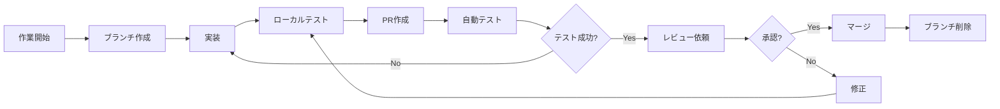

# 占い自動鑑定システム Git運用ルール

## 1. ブランチ戦略（GitHub Flow）

### 1.1 基本方針
- シンプルで理解しやすいGitHub Flowを採用
- mainブランチは常にデプロイ可能な状態を保つ
- 全ての変更はPull Request経由でマージ

### 1.2 ブランチ構成
```
main
  └── feature/issue-123-add-payment
  └── fix/issue-124-login-error
  └── hotfix/critical-security-patch
  └── docs/update-readme
  └── refactor/improve-performance
```

### 1.3 ブランチ命名規則
```
<type>/<issue-number>-<brief-description>

type:
  - feature: 新機能追加
  - fix: バグ修正
  - hotfix: 緊急修正
  - docs: ドキュメント更新
  - refactor: リファクタリング
  - test: テスト追加・修正
  - chore: ビルド・ツール関連

例:
  - feature/issue-123-add-tarot-fortune
  - fix/issue-124-pdf-generation-error
  - docs/issue-125-update-api-spec
```

## 2. コミット規約

### 2.1 コミットメッセージフォーマット
```
<type>(<scope>): <subject>

<body>

<footer>
```

### 2.2 Type一覧
| Type | 説明 | 例 |
|------|------|-----|
| feat | 新機能追加 | feat(fortune): タロット占いを追加 |
| fix | バグ修正 | fix(auth): ログインエラーを修正 |
| docs | ドキュメント変更 | docs(readme): インストール手順を更新 |
| style | コードフォーマット | style(button): インデントを修正 |
| refactor | リファクタリング | refactor(api): エラーハンドリングを改善 |
| perf | パフォーマンス改善 | perf(pdf): 生成速度を最適化 |
| test | テスト関連 | test(fortune): 単体テストを追加 |
| build | ビルド関連 | build(deps): Next.jsを14.2に更新 |
| ci | CI/CD関連 | ci(github): デプロイワークフローを追加 |
| chore | その他 | chore(deps): 依存関係を更新 |

### 2.3 Scope一覧
- auth: 認証関連
- fortune: 占い機能
- payment: 決済機能
- admin: 管理機能
- ui: UIコンポーネント
- api: API関連
- db: データベース関連

### 2.4 コミットメッセージ例
```bash
# 良い例 ✅
git commit -m "feat(fortune): Claude APIと連携したAI鑑定機能を実装

- プロンプトテンプレートを作成
- キューイングシステムを実装
- レート制限対策を追加

Closes #123"

# 悪い例 ❌
git commit -m "機能追加"
git commit -m "fix"
git commit -m "WIP"
```

## 3. Pull Request運用

### 3.1 PR作成時のルール
1. **タイトル**: コミットメッセージ規約に従う
   ```
   feat(fortune): AI鑑定機能を実装 (#123)
   ```

2. **説明**: 以下のテンプレートを使用

### 3.2 Pull Requestテンプレート
`.github/pull_request_template.md`:
```markdown
## 概要
<!-- このPRで何を実装/修正したかを簡潔に説明 -->

## 関連Issue
<!-- Closes #123 のように関連Issueを記載 -->
Closes #

## 変更内容
<!-- 主な変更点を箇条書きで記載 -->
- 
- 
- 

## スクリーンショット
<!-- UI変更がある場合は、変更前後のスクリーンショットを添付 -->

## テスト内容
<!-- 実施したテストを記載 -->
- [ ] ユニットテストを追加/更新
- [ ] ローカルで動作確認
- [ ] レスポンシブデザインの確認

## チェックリスト
- [ ] コーディング規約に準拠している
- [ ] 型チェックが通る（`npm run type-check`）
- [ ] リントエラーがない（`npm run lint`）
- [ ] テストが通る（`npm test`）
- [ ] ドキュメントを更新した（必要な場合）

## レビュー観点
<!-- レビュアーに特に見てほしい点があれば記載 -->
```

### 3.3 PRのライフサイクル


## 4. レビュー観点

### 4.1 コードレビューチェックリスト

#### 機能要件
- [ ] 要件を満たしているか
- [ ] エッジケースが考慮されているか
- [ ] エラーハンドリングが適切か

#### コード品質
- [ ] 可読性が高いか
- [ ] DRY原則に従っているか
- [ ] 適切な抽象化がされているか
- [ ] 命名が適切か

#### パフォーマンス
- [ ] 不要な再レンダリングがないか
- [ ] 重い処理が最適化されているか
- [ ] 適切なメモ化がされているか

#### セキュリティ
- [ ] 入力値の検証がされているか
- [ ] 認証・認可が適切か
- [ ] センシティブな情報が露出していないか

#### テスト
- [ ] テストカバレッジが十分か
- [ ] エッジケースがテストされているか
- [ ] テストが理解しやすいか

#### ドキュメント
- [ ] コメントが適切か
- [ ] 複雑な処理に説明があるか
- [ ] APIドキュメントが更新されているか

### 4.2 レビューコメントの書き方
```markdown
# 良い例 ✅
## 提案
この処理は`useMemo`でメモ化することで、パフォーマンスが改善できそうです。

```typescript
const processedData = useMemo(() => {
  return heavyProcessing(data);
}, [data]);
```

# 悪い例 ❌
これは良くない。
```

### 4.3 レビュー時の絵文字規約
- 🎯 **Must**: 必ず修正が必要
- 💭 **Should**: 修正を推奨
- 💡 **Consider**: 検討してみてください
- ❓ **Question**: 質問
- 👍 **Good**: 良い実装
- 📝 **Note**: 補足情報

## 5. マージ戦略

### 5.1 マージ方法
- **Squash and merge**を基本とする
- 1つの機能 = 1つのコミット
- コミット履歴をクリーンに保つ

### 5.2 マージ前チェックリスト
- [ ] CIが全て成功している
- [ ] レビューで承認を得ている
- [ ] conflictが解決されている
- [ ] ブランチが最新のmainから更新されている

### 5.3 マージ後の作業
```bash
# ローカルでmainを更新
git checkout main
git pull origin main

# マージ済みブランチを削除
git branch -d feature/issue-123-add-payment

# リモートの削除済みブランチを反映
git remote prune origin
```

## 6. 緊急時の対応（Hotfix）

### 6.1 Hotfixフロー
```bash
# 1. mainから直接ブランチを作成
git checkout main
git pull origin main
git checkout -b hotfix/critical-security-patch

# 2. 修正を実装
# ... 修正作業 ...

# 3. コミット
git commit -m "hotfix(security): SQLインジェクション脆弱性を修正"

# 4. PR作成（タイトルに[HOTFIX]を付ける）
# PR Title: [HOTFIX] セキュリティ脆弱性の緊急修正

# 5. 緊急レビュー＆マージ
```

### 6.2 Hotfix後の対応
- 本番環境に即座にデプロイ
- 全開発者に通知
- 事後レポートの作成

## 7. リリース管理

### 7.1 リリースタグ
```bash
# セマンティックバージョニング
# v<major>.<minor>.<patch>

# メジャーリリース（破壊的変更）
git tag -a v2.0.0 -m "Release version 2.0.0"

# マイナーリリース（機能追加）
git tag -a v1.1.0 -m "Release version 1.1.0"

# パッチリリース（バグ修正）
git tag -a v1.0.1 -m "Release version 1.0.1"

# タグをプッシュ
git push origin v1.1.0
```

### 7.2 リリースノート
```markdown
# v1.1.0 (2025-06-15)

## 🎉 新機能
- タロット占いを追加 (#123)
- PDF出力のデザインを改善 (#124)

## 🐛 バグ修正
- ログイン時のエラーを修正 (#125)
- 決済処理のタイムアウトを修正 (#126)

## 🔧 改善
- パフォーマンスを最適化 (#127)
- エラーメッセージを改善 (#128)

## 📝 ドキュメント
- APIドキュメントを更新 (#129)
```

## 8. トラブルシューティング

### 8.1 よくある問題

#### コンフリクトの解決
```bash
# mainの最新を取得
git checkout main
git pull origin main

# 作業ブランチに戻ってマージ
git checkout feature/your-branch
git merge main

# コンフリクトを解決
# ファイルを編集してコンフリクトマーカーを削除

# 解決完了
git add .
git commit -m "chore: mainブランチとのコンフリクトを解決"
```

#### 間違ったコミットの修正
```bash
# 直前のコミットメッセージを修正
git commit --amend -m "新しいコミットメッセージ"

# 直前のコミットに変更を追加
git add forgotten-file.ts
git commit --amend --no-edit
```

#### ブランチの付け替え
```bash
# 間違ったブランチで作業してしまった場合
git stash
git checkout correct-branch
git stash pop
```

## 9. CI/CD連携

### 9.1 GitHub Actions設定
`.github/workflows/ci.yml`:
```yaml
name: CI

on:
  pull_request:
    branches: [main]

jobs:
  test:
    runs-on: ubuntu-latest
    steps:
      - uses: actions/checkout@v3
      - uses: actions/setup-node@v3
        with:
          node-version: '20'
      - run: npm ci
      - run: npm run type-check
      - run: npm run lint
      - run: npm test
      - run: npm run build
```

### 9.2 自動化されるチェック
- 型チェック
- リント
- テスト実行
- ビルド確認

## 10. ベストプラクティス

### 10.1 コミットの粒度
- 1コミット = 1つの論理的な変更
- レビューしやすい大きさに保つ
- WIPコミットは避ける

### 10.2 ブランチの管理
- 作業が完了したらすぐにPRを作成
- 長期間放置されたブランチは削除
- 定期的にmainから更新を取り込む

### 10.3 コミュニケーション
- PRには十分な説明を記載
- レビューコメントには迅速に対応
- 不明点は積極的に質問

---

このGit運用ルールに従うことで、チーム全体で一貫性のある開発フローを維持できます。